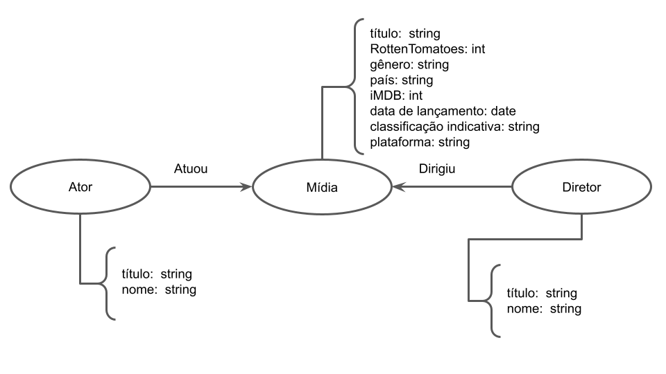

# Aluno
* `216741`: `George Gigilas Junior`

## Modelo Lógico do Banco de Dados de Grafos

> 

## Perguntas de Pesquisa/análise

> * Quais atores tem mais conexões com mídias em cada país?
> * Quais são as combinações mais frequentes entre um ator e um diretor?
> * Quais são os diretores que produziram mais filmes para cada gênero?
