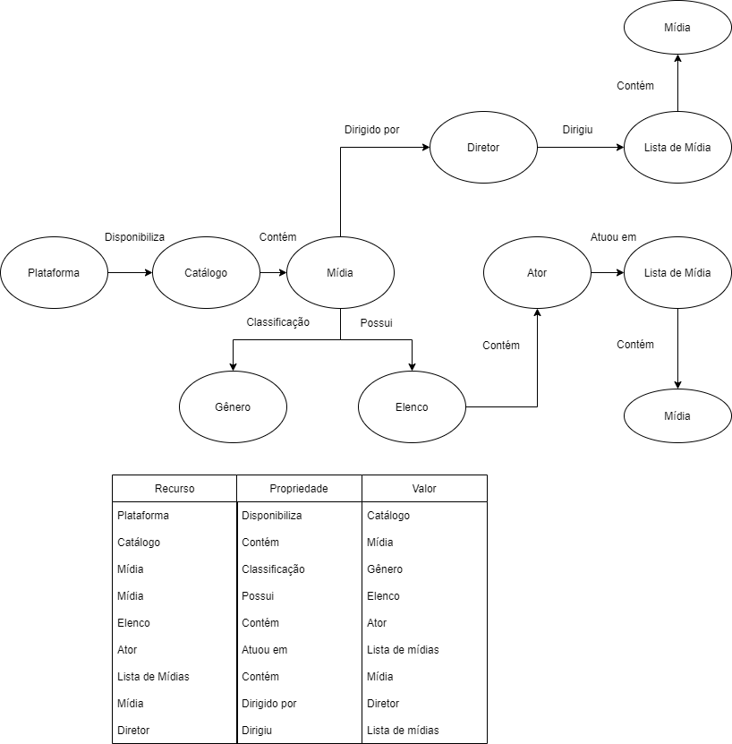

# Aluno
* `216741`: `George Gigilas Junior`

## Modelo Lógico do Banco de Dados de Grafos

> 

## Perguntas/Queries de Pesquisa/análise

> * Dado um ator, quais são as mídias em que ele já atuou?
> * Dado um diretor, quais são os atores com quem ele já trabalhou?
> * Dada uma plataforma, quantos atores/diretores nunca participaram de mídias de outra plataforma?